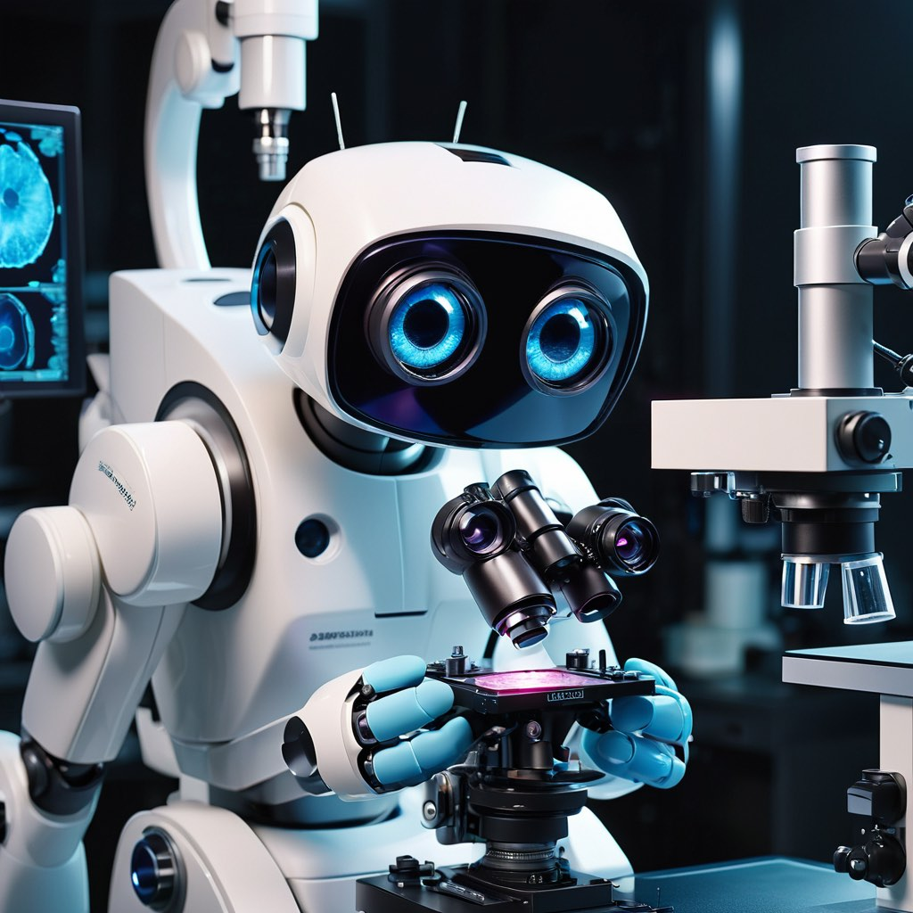

# AI in Pathology Seminar 🔬🧬

Welcome to the AI in Pathology, bi-weekly seminar hosted by the University in California, Irvine, [Dept. of Pathology](https://www.pathology.uci.edu/index.asp/), dedicated to everyone interested, Artificial Intelligence, pathology, medicine and beyond.

Join us to gain insights from leading experts in academia, industry, and healthcare as they showcase their pioneering research, experience with AI integration in medicine, and illuminate their career pathways that led them to the forefront of AI in healthcare. We aim to educate and inspire young researchers, especially females, to explore exciting career and research opportunities in AI and healthcare. The seminar is targeted for broad audience, including computer science, engineering, school of medicine and biomedical science.
 
 
 

## Schedule and Agenda from Summer 2024

* **Summer schedule:** April 5th, 2024 - June 28th, 2024
* **Time:** 2-3pm PST 
* **Frequency:** bi-weekly, always on Friday
* **Location:** [virtual]
* **To attend please [register](https://forms.gle/AFxvbwgS7JeCKuGn8)**
* For questions and inquiries please reach to us [here](mailto:antartiqcpath@gmail.com,jlipkova@hs.uci.edu)

## Speakers
| Day | Speaker(s) | Affiliation | Talk Title | Short Description | Poster | Recording |
| ------ | ------ | ------ | ------ | ------ | ------ | ------ |
| April 5th   |  Drs. [Jana Lipkova](http://octopath.org/jana.html), [William H. Yong](https://faculty.sites.uci.edu/whyonglab/about-dr-yong/) | [UCI, Dept. of Pathology](https://www.pathology.uci.edu/), CA| Welcome! Intro: AI & Pathology, AI in Cardiac Transplant | Introduction to pathology data, related AI methods, followed by presentation of AI model for cardiac transplant surgery applications 🔬🫀. | [link](link) | 
| April 19th  | Drs. [Marilyn Bui](https://www.moffitt.org/providers/marilyn-bui/), [Myles McCary](https://www.linkedin.com/in/mylesmccrary/), [Amanda Hermann](https://twitter.com/HerrPath)  | [Moffitt Cancer Center](https://www.moffitt.org/), FL | Adventures in Digital Path & AI - Clinicians perspective| Director of the Analytic Microscopy Core at Moffitt Cancer Center, expert on AI and digital pathology, Dr. Bui and her residences, will provide interactive talk about their clinical perspective and experiences on AI in pathology ⚕️🔬⭐.| | |
| May 3rd     | [Dr. Andrew Song](https://andrewhsong.wordpress.com/)   | [Harvard Medical School](https://hms.harvard.edu/) [AI for Pathology Lab](https://faisal.ai/) | Towards 3D pathology – The opportunities and challenges | Using AI to expand pathology into 3D for better diagnostic predictions and novel biomerker discovery 😲⭐🔬| | |
| May 17th    | TBD   |  | TBD|
| May 31th    | [Drew FK Williamson](https://www.dfkw.io/)   |  [Emory University School of Medicine](https://med.emory.edu/)|TBD | Board certified pathologist leading reasearch lab focussed on AI in pathology. Insights on Physician-Scientists career path ⚕️🔬⭐|
| June 14th   | TBD   | | TBD |
| June 28th   | TBD   | | TBD |

## Organizers and Sponsors
The seminar is supported by UCI School of Medicine, Dept. of Pahtology. It is co-organize by ANTartiqc (ANT-eaters ARTificial Inteligence and Quantum Computing) student club at UCI and supported by Drs. [Jana Lipkova](http://octopath.org/jana.html) and [William H. Yong](https://faculty.sites.uci.edu/whyonglab/about-dr-yong/) from UCI's Department of Pathology and Molecular Medicine.

